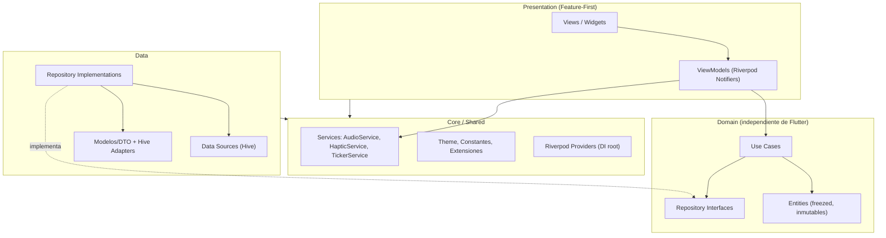
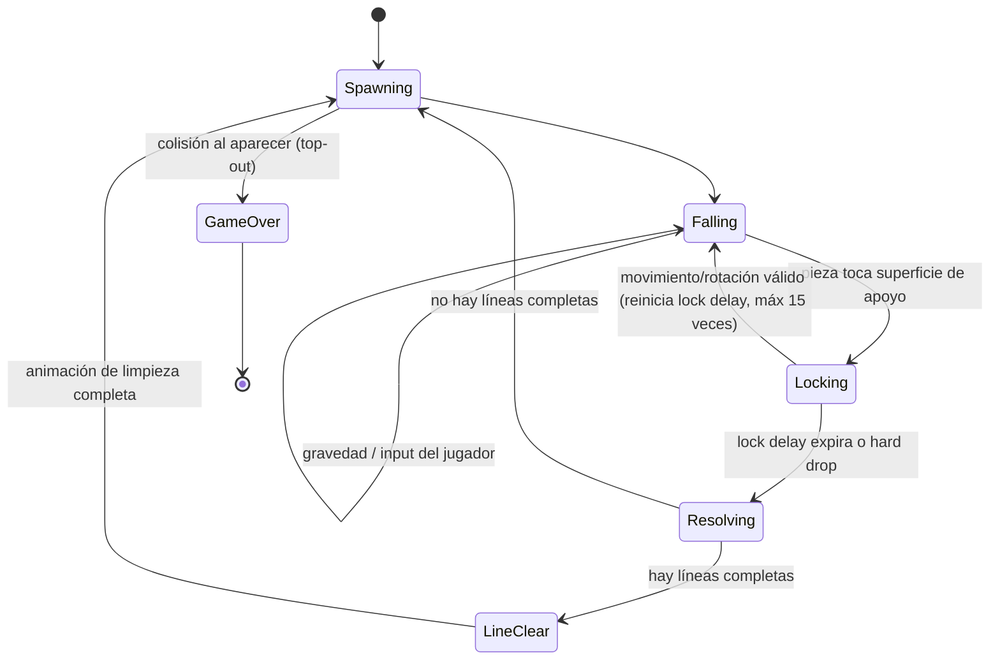
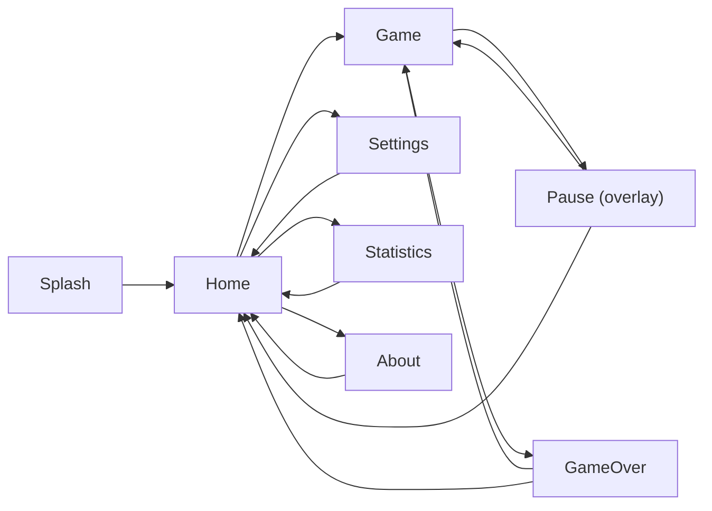

# spec.md — Extreme Focus Tetris

> **Documento de especificación funcional y técnica (SDD — Specification Driven Development)**
> Este documento es la **única fuente de verdad** del proyecto. Cualquier implementación debe derivarse exclusivamente de lo aquí descrito. Si algo no está especificado, se considera fuera de alcance para la versión 1.0.

| Campo | Valor |
|---|---|
| Proyecto | Extreme Focus Tetris |
| Plataforma | Android (Flutter, última versión estable) |
| Lenguaje | Dart |
| Tipo de uso | Personal, sin publicación comercial |
| Versión del documento | 1.0 |
| Estado | Aprobado para desarrollo |
| Modelo de monetización | Ninguno (sin ads, sin IAP, sin cuentas, sin red) |

---

## Índice

1. [Resumen ejecutivo y filosofía de producto](#1-resumen-ejecutivo-y-filosofía-de-producto)
2. [Alcance](#2-alcance)
3. [Arquitectura de software](#3-arquitectura-de-software)
4. [Dirección de arte y diseño visual](#4-dirección-de-arte-y-diseño-visual)
5. [Tipografía](#5-tipografía)
6. [Audio y vibración](#6-audio-y-vibración)
7. [Animaciones](#7-animaciones)
8. [Gameplay](#8-gameplay)
9. [Modos de juego](#9-modos-de-juego)
10. [Pantallas y flujos de navegación](#10-pantallas-y-flujos-de-navegación)
11. [Sistema de diseño UI](#11-sistema-de-diseño-ui)
12. [Configuración (Settings)](#12-configuración-settings)
13. [Persistencia local](#13-persistencia-local)
14. [Accesibilidad](#14-accesibilidad)
15. [Rendimiento](#15-rendimiento)
16. [Gestión de memoria](#16-gestión-de-memoria)
17. [Assets](#17-assets)
18. [Efectos visuales](#18-efectos-visuales)
19. [Física](#19-física)
20. [Internacionalización](#20-internacionalización)
21. [Testing](#21-testing)
22. [Seguridad y privacidad](#22-seguridad-y-privacidad)
23. [Calidad de código](#23-calidad-de-código)
24. [Dependencias](#24-dependencias)
25. [Organización del proyecto](#25-organización-del-proyecto)
26. [Roadmap](#26-roadmap)
27. [Casos de uso](#27-casos-de-uso)
28. [Requerimientos funcionales](#28-requerimientos-funcionales)
29. [Requerimientos no funcionales](#29-requerimientos-no-funcionales)
30. [Criterios de aceptación](#30-criterios-de-aceptación)
31. [Riesgos](#31-riesgos)
32. [Deuda técnica](#32-deuda-técnica)
33. [Mejoras futuras](#33-mejoras-futuras)
34. [Glosario](#34-glosario)

---

## 1. Resumen ejecutivo y filosofía de producto

**Extreme Focus Tetris** es una aplicación Android construida en Flutter que reinterpreta el Tetris clásico como una herramienta de **concentración profunda (Deep Focus)**, no como un juego competitivo. Es de uso estrictamente personal: no requiere red, cuentas, ni recolecta datos, y no incluye publicidad ni compras.

### 1.1 Principios de diseño (Design Pillars)

| Pilar | Descripción | Implicación técnica |
|---|---|---|
| **Inicio inmediato** | Jugable en < 5 segundos desde el ícono | Splash nativo + Flutter, sin llamadas de red, sin animaciones de marca largas, precarga mínima de assets críticos |
| **Cero fricción** | Sin login, sin onboarding forzado, sin permisos innecesarios | No se solicita ningún permiso de Android salvo vibración (implícito, no requiere runtime permission) |
| **Calma sobre desafío** | El juego debe relajar, no generar ansiedad | Curvas de velocidad suavizadas, sin flashes agresivos, sonido "tic-toc" calmante, Modo Concentración con HUD mínimo |
| **Fluidez absoluta** | 60 FPS estables en gama media-baja | Renderizado con `CustomPainter`, object pooling, sin overdraw |
| **Privacidad total** | Cero recolección de datos, cero red | `android:usesCleartextTraffic` no aplica (no hay tráfico), sin SDKs de analítica/ads |
| **Estética cartoon original** | Inspirado en el estilo de historietas japonesas/caricaturas clásicas (p. ej. Doraemon como referencia únicamente estilística) | Todo el arte es 100% original; no se reproducen personajes, logotipos ni assets protegidos |

### 1.2 Declaración de no objetivos

- No es un juego con progresión infinita de contenido, eventos en vivo ni multijugador online.
- No busca monetización ni retención agresiva (no hay notificaciones push, no hay "rachas" con presión social).
- No compite en profundidad competitiva con clientes de Tetris orientados a e-sports (aunque implementa reglas modernas del "Tetris Guideline" como base de calidad de gameplay).

---

## 2. Alcance

### 2.1 Dentro de alcance (v1.0)

- Motor de Tetris completo (SRS, 7-bag, hold, ghost piece, next queue, T-Spin, combos, back-to-back, perfect clear).
- Modo Clásico y Modo Concentración.
- Persistencia local de récord, estadísticas, configuración y última partida (resume).
- Pantallas: Splash, Home, Juego, Pausa (overlay), Game Over, Settings, Statistics, Acerca de.
- Sonido tic-toc ambiental configurable + SFX + vibración háptica opcional.
- Accesibilidad básica (daltonismo, tamaño de texto, alto contraste).
- Español e inglés.
- Tema claro ("Day Focus") y oscuro ("Night Focus").

### 2.2 Fuera de alcance (v1.0)

- iOS, Web, Desktop (arquitectura preparada para portar, pero no se construye ni prueba en v1.0).
- Multijugador (local o en línea).
- Compras, publicidad, cuentas, backend, analítica, notificaciones push.
- Motor de física de terceros (ver sección 19).

---

## 3. Arquitectura de software

### 3.1 Decisión arquitectónica

Se adopta **Clean Architecture + Feature-First**, combinada con **MVVM** en la capa de presentación, **Repository Pattern** en la capa de datos y **Riverpod** como mecanismo de estado y de inyección de dependencias.

#### Justificación de Riverpod frente a Provider y Bloc

| Criterio | Provider | Bloc | **Riverpod (elegido)** |
|---|---|---|---|
| Seguridad en compilación (sin `BuildContext`) | Parcial (depende de `context`) | Sí | **Sí**, los providers son globales y verificables en compile-time |
| Testabilidad de lógica de juego a 60 FPS sin widgets | Media | Alta, pero con boilerplate (Events/States) por cada acción | **Alta**, `Notifier`/`AsyncNotifier` puros, testeables sin `WidgetTester` |
| Boilerplate | Bajo | Alto (Event → Bloc → State por cada interacción: mover, rotar, drop, hold...) | **Bajo-medio**, con `riverpod_generator` se reduce aún más |
| Rebuilds granulares (`select`) | Limitado | Sí (con `BlocSelector`) | **Sí**, nativo con `.select` |
| Mantenimiento activo / comunidad Flutter | Legacy (mismo autor recomienda Riverpod) | Activo | **Activo, recomendado por el propio autor de Provider** |
| Adecuación a un loop de juego (60 ticks/seg) | No ideal | Sobre-ingeniería para tantas transiciones de estado por segundo | **Ideal**: un `StateNotifier` de tablero se actualiza por ticker sin necesidad de modelar cada frame como "evento" |

**Conclusión:** Riverpod evita el boilerplate de Bloc (inapropiado para un game loop de alta frecuencia) y supera las limitaciones de `Provider` en testabilidad y seguridad de tipos. Además actúa como contenedor de **Dependency Injection**, por lo que no se necesita `get_it` adicional.

### 3.2 Capas (Clean Architecture)



**Regla de dependencia:** las flechas de conocimiento apuntan siempre hacia adentro (Domain no conoce Data ni Presentation). `Domain` es Dart puro (sin `package:flutter`), lo que permite testear reglas de Tetris sin levantar el framework de widgets.

### 3.3 Patrones aplicados

| Patrón | Dónde se usa | Motivo |
|---|---|---|
| **Repository Pattern** | `GameRepository`, `SettingsRepository`, `StatisticsRepository` | Aísla la fuente de datos (Hive) del dominio; permite cambiar de almacenamiento sin tocar lógica de negocio |
| **MVVM** | Cada feature: `View` (Widget) ↔ `ViewModel` (Riverpod `Notifier`) | Separa lógica de presentación de la UI declarativa |
| **Service Layer** | `AudioService`, `HapticService`, `PersistenceService` | Encapsula side-effects (plugins nativos) detrás de interfaces inyectables y mockeables |
| **Dependency Injection** | `Provider`/`riverpod_generator` en `core/di` | Sustituye implementaciones reales por fakes en tests |
| **Object Pool** | `ParticlePool` en el motor de renderizado | Evita GC churn en efectos de partículas (ver sección 16) |
| **State Machine** | `GameEngine` (dominio) y `AppRouter` (navegación) | Modela transiciones de forma explícita y verificable |
| **Strategy** | Cálculo de puntaje (`ScoringStrategy`) para permitir variantes futuras (ej. modo maratón) | Abre extensión sin modificar el núcleo (Open/Closed) |

### 3.4 Estructura de carpetas completa

```
extreme_focus_tetris/
├── android/
├── assets/
│   ├── fonts/
│   │   ├── Fredoka-Regular.ttf
│   │   ├── Fredoka-Medium.ttf
│   │   ├── Fredoka-SemiBold.ttf
│   │   ├── Nunito-Regular.ttf
│   │   ├── Nunito-SemiBold.ttf
│   │   └── Nunito-Bold.ttf
│   ├── images/
│   │   ├── icons/
│   │   ├── logo/
│   │   └── backgrounds/
│   └── audio/
│       ├── ambient/
│       │   └── tic_toc_loop.ogg
│       └── sfx/
│           ├── move.ogg
│           ├── rotate.ogg
│           ├── soft_drop.ogg
│           ├── hard_drop.ogg
│           ├── line_clear_1.ogg
│           ├── line_clear_2.ogg
│           ├── line_clear_3.ogg
│           ├── line_clear_tetris.ogg
│           ├── tspin.ogg
│           ├── level_up.ogg
│           ├── game_over.ogg
│           ├── pause.ogg
│           ├── button_tap.ogg
│           └── hold.ogg
├── lib/
│   ├── main.dart
│   ├── app.dart                          # MaterialApp.router + tema + locale
│   ├── core/
│   │   ├── constants/
│   │   │   ├── app_dimens.dart
│   │   │   ├── app_durations.dart
│   │   │   └── game_constants.dart       # tamaños de grid, curvas de velocidad, etc.
│   │   ├── theme/
│   │   │   ├── app_colors.dart
│   │   │   ├── app_text_styles.dart
│   │   │   ├── app_theme_light.dart
│   │   │   └── app_theme_dark.dart
│   │   ├── di/
│   │   │   └── providers.dart            # providers raíz (servicios, repos)
│   │   ├── routing/
│   │   │   ├── app_router.dart           # go_router config
│   │   │   └── routes.dart
│   │   ├── services/
│   │   │   ├── audio_service.dart
│   │   │   ├── haptic_service.dart
│   │   │   └── game_ticker_service.dart
│   │   ├── error/
│   │   │   └── failures.dart
│   │   ├── utils/
│   │   │   └── extensions.dart
│   │   └── l10n/
│   │       ├── app_en.arb
│   │       └── app_es.arb
│   ├── features/
│   │   ├── splash/
│   │   │   └── presentation/
│   │   │       └── splash_screen.dart
│   │   ├── home/
│   │   │   └── presentation/
│   │   │       ├── home_screen.dart
│   │   │       └── widgets/
│   │   ├── game/
│   │   │   ├── domain/
│   │   │   │   ├── entities/
│   │   │   │   │   ├── tetromino.dart
│   │   │   │   │   ├── board.dart
│   │   │   │   │   ├── game_state.dart
│   │   │   │   │   └── score.dart
│   │   │   │   ├── repositories/
│   │   │   │   │   └── game_repository.dart      # interfaz
│   │   │   │   └── usecases/
│   │   │   │       ├── rotate_piece.dart
│   │   │   │       ├── move_piece.dart
│   │   │   │       ├── hard_drop.dart
│   │   │   │       ├── hold_piece.dart
│   │   │   │       ├── resolve_line_clears.dart
│   │   │   │       ├── calculate_score.dart
│   │   │   │       └── detect_tspin.dart
│   │   │   ├── data/
│   │   │   │   ├── models/
│   │   │   │   │   └── game_snapshot_model.dart  # Hive TypeAdapter
│   │   │   │   ├── datasources/
│   │   │   │   │   └── game_local_datasource.dart
│   │   │   │   └── repositories/
│   │   │   │       └── game_repository_impl.dart
│   │   │   └── presentation/
│   │   │       ├── viewmodels/
│   │   │       │   └── game_controller.dart      # Riverpod Notifier + game loop
│   │   │       ├── game_screen.dart
│   │   │       └── widgets/
│   │   │           ├── board_painter.dart         # CustomPainter del tablero
│   │   │           ├── hud_classic.dart
│   │   │           ├── hud_focus.dart
│   │   │           ├── next_queue_widget.dart
│   │   │           ├── hold_widget.dart
│   │   │           ├── touch_controls.dart
│   │   │           └── pause_overlay.dart
│   │   ├── game_over/
│   │   │   └── presentation/
│   │   │       └── game_over_screen.dart
│   │   ├── settings/
│   │   │   ├── domain/
│   │   │   │   ├── entities/settings.dart
│   │   │   │   ├── repositories/settings_repository.dart
│   │   │   │   └── usecases/
│   │   │   ├── data/
│   │   │   └── presentation/
│   │   │       └── settings_screen.dart
│   │   ├── statistics/
│   │   │   ├── domain/
│   │   │   ├── data/
│   │   │   └── presentation/
│   │   │       └── statistics_screen.dart
│   │   └── about/
│   │       └── presentation/
│   │           └── about_screen.dart
│   └── shared/
│       └── widgets/
│           ├── ef_button.dart
│           ├── ef_card.dart
│           └── ef_section_title.dart
├── test/
│   ├── unit/
│   │   └── game/                          # rotación, colisiones, scoring, t-spin
│   ├── widget/
│   └── golden/
├── integration_test/
│   └── app_test.dart
├── analysis_options.yaml
├── pubspec.yaml
└── spec.md
```

---

## 4. Dirección de arte y diseño visual

### 4.1 Estilo

Inspiración en historietas japonesas y caricaturas clásicas (Doraemon citado únicamente como **referencia de estilo**, nunca de contenido): colores vivos, líneas gruesas (stroke ~3–4px sobre cada bloque), formas redondeadas (`border-radius` generoso, esquinas de tetrominós ligeramente curvadas), apariencia amigable y alegre. **Todo el arte es original**; queda prohibido reutilizar personajes, logotipos, paletas idénticas o cualquier elemento identificable de obras protegidas.

### 4.2 Paleta de colores

| Token | Hex | Uso | Justificación |
|---|---|---|---|
| `primary` | `#3FA9F5` (Sky Blue) | Marca, acentos principales, splash | Azul cian evoca calma y concentración (asociación psicológica azul-tranquilidad); alto contraste sobre fondo oscuro y claro |
| `secondary` | `#FFD23F` (Warm Gold) | Highlights, próximo nivel, combos | Complementario cálido al azul; transmite alegría sin agresividad (evita rojos saturados que elevan tensión) |
| `background.dark` | `#12162B` (Night Indigo) | Fondo tema "Night Focus" | Reduce fatiga visual en sesiones largas/nocturnas; suficientemente oscuro sin ser negro puro (evita "smearing" en OLED y facilita contraste de partículas) |
| `background.light` | `#FFF8ED` (Warm Cream) | Fondo tema "Day Focus" | Blanco cálido en vez de blanco puro: menos deslumbrante, coherente con estética cartoon amigable |
| `surface` | `#1E2340` / `#FFFFFF` | Cards, paneles HUD (dark/light) | Diferenciación sutil de profundidad sin recurrir a sombras duras |
| `block.I` | `#4FD3E8` (Cyan) | Tetrominó I | Colores de bloque distintos entre sí y del fondo, revisados contra deuteranopia/protanopia (ver sección 14) |
| `block.O` | `#FFD23F` (Gold) | Tetrominó O | |
| `block.T` | `#C77DFF` (Lavender) | Tetrominó T | |
| `block.S` | `#4CD97B` (Green) | Tetrominó S | |
| `block.Z` | `#FF6B6B` (Coral Red) | Tetrominó Z | |
| `block.J` | `#5C7CFA` (Indigo Blue) | Tetrominó J | |
| `block.L` | `#FF9F45` (Orange) | Tetrominó L | |
| `particles` | `#FFF4D6` (Soft Gold Glow) | Partículas de línea completada | Tono cálido y brillante para sensación de "logro suave", sin saturación agresiva |
| `hud.panel` | `rgba(255,255,255,0.08)` sobre dark / `rgba(18,22,43,0.06)` sobre light | Paneles de HUD | Transparencia para no competir visualmente con el tablero |
| `button.primary` | `#FF6B6B` (Coral) | Botones de acción principal (Jugar) | Cálido, invita a la acción sin ser tan intenso como un rojo puro |
| `button.confirm` | `#4CD97B` (Green) | Confirmar/Reanudar | Asociación universal de "seguir/aceptar" |
| `text.onDark` | `#F5F5F5` | Texto sobre fondo oscuro | Contraste AA+ garantizado (ratio > 7:1) |
| `text.onLight` | `#1B1F3B` | Texto sobre fondo claro | Contraste AA+ garantizado |
| `fx.special` | Gradiente `#FFD23F → #FF6B6B` | Tetris, T-Spin, Perfect Clear | Gradiente cálido reservado a eventos especiales, refuerza jerarquía de recompensa sin depender de destellos blancos agresivos |

### 4.3 Temas

Dos temas oficiales: **Day Focus** (claro, cálido) y **Night Focus** (oscuro, índigo). Se seleccionan en Settings; por defecto sigue el tema del sistema (`ThemeMode.system`).

---

## 5. Tipografía

| Rol | Fuente | Motivo |
|---|---|---|
| Display / Títulos / HUD numérico grande | **Fredoka** (Google Fonts, licencia OFL, gratuita) | Geometría redondeada, trazos gruesos, encaja con la estética cartoon; buena legibilidad a tamaños grandes |
| Cuerpo de texto / Settings / Statistics | **Nunito** (Google Fonts, licencia OFL, gratuita) | Sans-serif redondeada, muy legible en tamaños pequeños, amigable pero neutra para listas y formularios |

**Importante — requisito de "cero red":** las fuentes se **empaquetan como assets locales** (`assets/fonts/*.ttf`) declaradas en `pubspec.yaml` bajo `fonts:`. **No se usa el paquete `google_fonts` en su modo de descarga en tiempo de ejecución**, ya que realiza fetch remoto la primera vez que no encuentra la fuente cacheada — esto violaría el requisito de "sin conexión a Internet" incluso en el primer arranque.

---

## 6. Audio y vibración

### 6.1 Música

**No hay música de fondo.** Esta es una decisión de producto irrevocable: el objetivo es concentración, no ambientación musical.

### 6.2 Sonido ambiental — "tic-toc"

- Loop continuo de dos golpes alternos (**tic** grave / **toc** agudo suave), tipo metrónomo relajado, **60–72 BPM** (ritmo similar a un pulso en reposo, evita ansiedad).
- Timbre orgánico y suave (madera/reloj de mesa), **sin componentes agudos punzantes**.
- Loop **seamless** (sin clics de empalme), archivo `tic_toc_loop.ogg`, normalizado a -16 LUFS aprox. para no competir con SFX.
- Control independiente: **on/off** + **volumen propio** (slider 0–100%), separado del volumen de SFX.
- Se pausa automáticamente cuando la app pasa a segundo plano y se reanuda al volver (usando `AppLifecycleState`).

### 6.3 Efectos de sonido (SFX)

| Evento | Archivo | Carácter sonoro |
|---|---|---|
| Movimiento lateral | `move.ogg` | Clic muy suave, casi imperceptible |
| Rotación | `rotate.ogg` | "Swish" corto y ligero |
| Soft drop | `soft_drop.ogg` | Tick sutil, más grave que el movimiento |
| Hard drop | `hard_drop.ogg` | Golpe seco corto ("thud"), sin ser estruendoso |
| Hold | `hold.ogg` | Tono breve tipo "swap" |
| Línea completada (1–3 líneas) | `line_clear_1/2/3.ogg` | Campanilla ascendente, intensidad proporcional a líneas |
| Tetris (4 líneas) | `line_clear_tetris.ogg` | Arpegio cálido más largo, recompensa mayor pero no estridente |
| T-Spin | `tspin.ogg` | Tono distintivo tipo "chime" medio |
| Subida de nivel | `level_up.ogg` | Progresión ascendente corta y suave |
| Game Over | `game_over.ogg` | Tono descendente suave, deliberadamente **no dramático** (coherente con "sin ansiedad") |
| Pausa | `pause.ogg` | Blip breve y neutro |
| Botón (UI tap) | `button_tap.ogg` | Clic ligero consistente en toda la app |

Todos los SFX y el loop ambiental respetan el volumen maestro y el toggle general de sonido, además del volumen/])toggle propio del ambiente.

### 6.4 Vibración háptica

- **Opcional**, activable/desactivable en Settings.
- Se implementa con `HapticFeedback` (API nativa de Flutter, sin dependencias adicionales):

| Evento | Tipo de feedback |
|---|---|
| Movimiento lateral | `HapticFeedback.selectionClick()` |
| Rotación | `HapticFeedback.lightImpact()` |
| Hard drop / Lock | `HapticFeedback.mediumImpact()` |
| Línea completada / Tetris / T-Spin | `HapticFeedback.heavyImpact()` |
| Game Over | `HapticFeedback.vibrate()` (patrón corto único) |

Se elige la API nativa en vez del paquete `vibration` para mantener el footprint de dependencias mínimo, ya que no se requiere control de amplitud personalizado (fuera de alcance v1.0; ver sección 33).

---

## 7. Animaciones

| Animación | Duración | Curva | Detalle |
|---|---|---|---|
| Splash → Home (fade + logo scale) | 600 ms | `Curves.easeOutCubic` | Logo escala de 0.9→1.0 con fade-in; no bloquea el arranque, se ejecuta en paralelo a la precarga |
| Entrada de pantalla (push) | 250 ms | `Curves.easeInOut` | Slide + fade combinado (`SharedAxisTransition` horizontal vía `go_router` builder) |
| Salida de pantalla (pop) | 200 ms | `Curves.easeIn` | Inverso de la entrada |
| Caída de pieza (gravedad) | Depende del nivel (ver 8.6) | Lineal (determinística por grid) | Interpolación discreta por celda, no easing (debe sentirse precisa) |
| Rotación de pieza | 80 ms | `Curves.easeOutBack` (leve overshoot) | Da sensación "juguetona" acorde al estilo cartoon |
| Movimiento lateral | 60 ms | `Curves.easeOut` | Snap rápido a la celda destino |
| Hard drop | 40 ms (trail) + impacto | `Curves.easeIn` | Estela semitransparente vertical + partículas de impacto |
| Desaparición de línea | 320 ms total | `Curves.easeInOutCubic` | Fase 1 (0–120ms): flash + shake horizontal leve de la fila; Fase 2 (120–320ms): colapso vertical de filas superiores |
| Partículas (línea/tetris) | 400–700 ms según cantidad | Física simple (ver sección 18) | Emisión desde celdas limpiadas, gravedad + fricción, fade-out final |
| Level Up banner | 900 ms (aparece 200 ms, sostiene 500 ms, desvanece 200 ms) | `Curves.easeOutBack` entrada / `Curves.easeIn` salida | Discreto en Modo Concentración (ver 9.2) |
| Game Over | 500 ms overlay fade-in + 300 ms shake sutil del tablero | `Curves.easeOut` | Sin flashes rojos agresivos; overlay oscurece el tablero gradualmente |
| Botones (press feedback) | 100 ms | `Curves.easeOut` | Scale 1.0→0.96 al presionar, vuelta a 1.0 al soltar |
| Transiciones de menú (Settings/Statistics) | 220 ms | `Curves.easeInOutCubic` | Fade + slide vertical leve (12px) |

**FPS objetivo:** 60 FPS en todas las animaciones; ninguna animación debe depender de reconstrucciones de widgets pesados — las animaciones del tablero se resuelven dentro del mismo `CustomPainter` (ver sección 15).

---

## 8. Gameplay

### 8.1 Tablero

- Grid estándar: **10 columnas × 20 filas visibles** (+ 2 filas ocultas de spawn superior, total interno 22 filas), conforme al Tetris Guideline.

### 8.2 Sistema de rotación — SRS (Super Rotation System)

Se implementa el **SRS** estándar con 4 estados de rotación por pieza (`0`, `R`, `2`, `L`) y tablas de *wall kick*.

**Tabla de wall kicks — piezas J, L, S, T, Z** (offsets `(x, y)`, se prueba en orden hasta encontrar una posición válida):

| Transición | Test 1 | Test 2 | Test 3 | Test 4 | Test 5 |
|---|---|---|---|---|---|
| 0→R | (0,0) | (-1,0) | (-1,1) | (0,-2) | (-1,-2) |
| R→0 | (0,0) | (1,0) | (1,-1) | (0,2) | (1,2) |
| R→2 | (0,0) | (1,0) | (1,-1) | (0,2) | (1,2) |
| 2→R | (0,0) | (-1,0) | (-1,1) | (0,-2) | (-1,-2) |
| 2→L | (0,0) | (1,0) | (1,1) | (0,-2) | (1,-2) |
| L→2 | (0,0) | (-1,0) | (-1,-1) | (0,2) | (-1,2) |
| L→0 | (0,0) | (-1,0) | (-1,-1) | (0,2) | (-1,2) |
| 0→L | (0,0) | (1,0) | (1,1) | (0,-2) | (1,-2) |

**Tabla de wall kicks — pieza I** (offsets `(x, y)`):

| Transición | Test 1 | Test 2 | Test 3 | Test 4 | Test 5 |
|---|---|---|---|---|---|
| 0→R | (0,0) | (-2,0) | (1,0) | (-2,-1) | (1,2) |
| R→0 | (0,0) | (2,0) | (-1,0) | (2,1) | (-1,-2) |
| R→2 | (0,0) | (-1,0) | (2,0) | (-1,2) | (2,-1) |
| 2→R | (0,0) | (1,0) | (-2,0) | (1,-2) | (-2,1) |
| 2→L | (0,0) | (2,0) | (-1,0) | (2,1) | (-1,-2) |
| L→2 | (0,0) | (-2,0) | (1,0) | (-2,-1) | (1,2) |
| L→0 | (0,0) | (1,0) | (-2,0) | (1,-2) | (-2,1) |
| 0→L | (0,0) | (-1,0) | (2,0) | (-1,2) | (2,-1) |

La pieza **O** no rota (single-state).

### 8.3 Generador de piezas — 7-bag

Cada "bolsa" contiene una permutación aleatoria de las 7 piezas (`I,O,T,S,Z,J,L`); se garantiza que nunca pasen más de 12 piezas sin ver una determinada figura. Se usa `Random` sembrado por reloj del sistema (no determinístico entre partidas, no requiere semilla persistida salvo para "resume" de última partida, donde sí se persiste el estado del bag).

### 8.4 Mecánicas de control

| Mecánica | Descripción |
|---|---|
| **Movimiento lateral** | Tap en flechas táctiles o swipe corto; soporta **DAS** (Delayed Auto Shift, 170 ms) y **ARR** (Auto Repeat Rate, 30 ms) al mantener presionado |
| **Soft drop** | Botón/swipe hacia abajo; multiplica velocidad de caída ×20 mientras se mantiene, otorga 1 punto por celda descendida |
| **Hard drop** | Swipe rápido hacia abajo o botón dedicado; caída instantánea + bloqueo inmediato, otorga 2 puntos por celda |
| **Rotación horaria/antihoraria** | Botones dedicados (o tap simple = horario, doble tap = antihorario, configurable) |
| **Hold** | Botón dedicado; guarda la pieza actual, intercambia con la almacenada (o coloca la actual y guarda si el hold está vacío); **bloqueado a 1 uso por pieza** hasta que la pieza activa se bloquee en el tablero |
| **Ghost piece** | Silueta semitransparente (`opacity` 25%) que muestra la posición final de caída; activable/desactivable en Settings |
| **Next queue** | Muestra **3 piezas siguientes** |
| **Lock delay** | 500 ms tras tocar superficie antes de fijarse; se reinicia con cada movimiento/rotación válido hasta un máximo de **15 reinicios** (evita "infinito" de lock delay) |

### 8.5 Sistema de puntuación

| Acción | Puntos |
|---|---|
| Single (1 línea) | 100 × nivel |
| Double (2 líneas) | 300 × nivel |
| Triple (3 líneas) | 500 × nivel |
| Tetris (4 líneas) | 800 × nivel |
| T-Spin Mini (sin líneas) | 100 × nivel |
| T-Spin Mini Single | 200 × nivel |
| T-Spin Mini Double | 400 × nivel |
| T-Spin (sin líneas) | 400 × nivel |
| T-Spin Single | 800 × nivel |
| T-Spin Double | 1200 × nivel |
| T-Spin Triple | 1600 × nivel |
| Perfect Clear Single | 800 × nivel (bono adicional) |
| Perfect Clear Double | 1200 × nivel |
| Perfect Clear Triple | 1800 × nivel |
| Perfect Clear Tetris | 2000 × nivel |
| Combo (líneas consecutivas sin fallo) | 50 × combo × nivel |
| Back-to-Back (Tetris o T-Spin —mini o full— que limpie al menos 1 línea, de forma consecutiva) | ×1.5 sobre el puntaje base de esa limpieza |
| Soft drop | 1 punto por celda |
| Hard drop | 2 puntos por celda |

### 8.6 Nivel y curva de velocidad

- El nivel sube cada **10 líneas** acumuladas.
- Velocidad expresada en milisegundos por caída de una celda:

| Nivel | Intervalo de caída (ms) |
|---|---|
| 1 | 1000 |
| 2 | 850 |
| 3 | 700 |
| 4 | 600 |
| 5 | 500 |
| 6 | 400 |
| 7 | 330 |
| 8 | 270 |
| 9 | 220 |
| 10 | 180 |
| 11–13 | 150 |
| 14–16 | 120 |
| 17–19 | 100 |
| 20+ | 80 (velocidad máxima, tope) |

En **Modo Concentración**, la curva se **limita al equivalente del nivel 10 (180 ms)** como máximo de velocidad, para preservar la sensación de calma (ver sección 9.2).

### 8.7 Detección de T-Spin

Se usa la regla estándar **"3-corner T"**: tras una rotación (no un movimiento simple) de la pieza T, si al menos 3 de las 4 esquinas adyacentes al centro de la pieza T están ocupadas (por bloques o bordes del tablero), se considera T-Spin. Si exactamente 2 de las 2 esquinas "frontales" están libres pero se cumple la condición de las 3 esquinas vía *wall kick* específico, se clasifica como **T-Spin Mini**.

### 8.8 Perfect Clear

Se detecta cuando, tras resolver las líneas completas de una jugada, el tablero queda completamente vacío. Otorga el bono correspondiente de la tabla 8.5.

### 8.9 Estadísticas registradas por partida y acumuladas

- Puntaje de la partida y récord histórico.
- Líneas totales, líneas por tipo (single/double/triple/tetris), T-Spins, Perfect Clears.
- Nivel máximo alcanzado.
- Tiempo jugado (por partida y acumulado histórico).
- Partidas jugadas totales.
- Combo máximo alcanzado.

### 8.10 Máquina de estados del motor de juego



---

## 9. Modos de juego

### 9.1 Modo Clásico

HUD completo: puntaje, nivel, líneas, next queue (3 piezas), hold, ghost piece, combo indicator, tiempo de partida.

### 9.2 Modo Concentración (Focus Mode)

- HUD **mínimo**: solo tablero, pieza siguiente (1, no 3), y un indicador discreto de tiempo transcurrido (opcional, activable).
- Sin banners de "Level Up" prominentes (se reemplaza por un cambio sutil de tono en el borde del tablero, 400 ms de fade).
- Curva de velocidad topada (ver 8.6).
- Paleta ligeramente **desaturada** respecto al modo clásico (−10% saturación) para reforzar la sensación de calma.
- El sonido tic-toc se vuelve el elemento sonoro predominante (SFX de UI se atenúan −6dB adicionales respecto al modo clásico).
- Sin popups de "combo x N" grandes; se muestra un pequeño glow en el borde del tablero en su lugar.
- Pausa disponible en cualquier momento sin penalización.

---

## 10. Pantallas y flujos de navegación

### 10.1 Flujo de navegación general



### 10.2 Especificación por pantalla

#### Splash

```
┌───────────────────────┐
│                        │
│                        │
│        [Logo]          │
│  Extreme Focus Tetris  │
│                        │
│                        │
└───────────────────────┘
```
- Duración máxima: **800 ms** (o hasta que finalice la precarga de assets críticos, lo que sea mayor, con tope duro de 1.5 s).
- Splash nativo de Android (`flutter_native_splash`) idéntico visualmente al de Flutter para evitar "parpadeo" entre el splash del sistema y el de la app.

#### Home

```
┌───────────────────────┐
│   Extreme Focus Tetris │
│                        │
│   Récord: 128,400      │
│                        │
│   ┌──────────────────┐ │
│   │      JUGAR       │ │
│   └──────────────────┘ │
│   ┌────────┐┌────────┐ │
│   │ Estad. ││ Config.│ │
│   └────────┘└────────┘ │
│   ┌──────────────────┐ │
│   │  Acerca de        │ │
│   └──────────────────┘ │
└───────────────────────┘
```
- Botón "JUGAR" inicia partida nueva en Modo Clásico por defecto; un toggle secundario permite elegir Modo Concentración antes de iniciar.
- Si existe una partida pausada previa (guardada en cierre de app), se muestra "Continuar" como acción primaria en su lugar.

#### Juego (Game)

```
┌───────────────────────┐
│ ⏸  Nivel 3   00:42     │  <- HUD superior (clásico)
│ ┌───┐         ┌─────┐  │
│ │HLD│  BOARD  │NEXT │  │
│ │   │  10x20  │ x3  │  │
│ └───┘         └─────┘  │
│  Score: 12,340         │
│  [◀] [▼] [▶]  [⟳] [⤓]  │  <- controles táctiles
└───────────────────────┘
```
- En Modo Concentración, se elimina el panel de Hold visible por defecto (accesible igual vía gesto), Next Queue se reduce a 1 pieza, y el score se muestra en tamaño reducido en una esquina.

#### Pausa (overlay semitransparente sobre el tablero)

```
┌───────────────────────┐
│                        │
│       ⏸ PAUSA          │
│  ┌──────────────────┐  │
│  │    Reanudar       │  │
│  └──────────────────┘  │
│  ┌──────────────────┐  │
│  │ Reiniciar partida │  │
│  └──────────────────┘  │
│  ┌──────────────────┐  │
│  │  Salir al menú    │  │
│  └──────────────────┘  │
└───────────────────────┘
```

#### Game Over

```
┌───────────────────────┐
│      GAME OVER         │
│   Puntaje: 45,600      │
│   ¡Nuevo récord! 🏆    │
│                        │
│  ┌──────────────────┐  │
│  │   Jugar de nuevo  │  │
│  └──────────────────┘  │
│  ┌──────────────────┐  │
│  │   Menú principal  │  │
│  └──────────────────┘  │
└───────────────────────┘
```
- Overlay con fade suave, sin colores rojos alarmantes (ver 6.3, 7).

#### Settings

Ver especificación detallada en sección 12.

#### Statistics

```
┌───────────────────────┐
│      Estadísticas       │
│  Récord:        128,400 │
│  Partidas:            47│
│  Líneas totales:      612│
│  Tetrises:             8│
│  T-Spins:              3│
│  Perfect Clears:        1│
│  Tiempo jugado: 3h 12m  │
│  ┌──────────────────┐   │
│  │ Reiniciar estad.  │   │
│  └──────────────────┘   │
└───────────────────────┘
```

#### Acerca de (About)

```
┌───────────────────────┐
│   Extreme Focus Tetris  │
│   Versión 1.0.0 (build 1)│
│   Uso personal.          │
│   Sin anuncios, sin      │
│   compras, sin conexión. │
└───────────────────────┘
```
Muestra versión vía `package_info_plus`.

---

## 11. Sistema de diseño UI

| Token | Valor |
|---|---|
| Spacing base | 4 px (escala: 4, 8, 12, 16, 24, 32, 48) |
| Radio de borde — botones | 16 px |
| Radio de borde — cards/paneles | 20 px |
| Radio de borde — bloques del tablero | 4 px (esquinas suavizadas, no completamente circulares) |
| Elevación / sombra | Sombra suave `blur 12px, opacity 12%`, sin bordes duros (coherente con estética cartoon) |
| Grosor de stroke en bloques | 3 px, color `#00000030` (oscurecido del propio color de bloque, no negro puro) |
| Tamaño mínimo de target táctil | 48×48 dp (cumple guidelines de Android) |
| Botón primario | Alto 56dp, texto Fredoka SemiBold 18sp, radio 16px, sombra suave |
| Card estadística | Padding 16px, radio 20px, fondo `surface` |
| Iconografía | Set propio, estilo "line + fill" redondeado, grosor de trazo consistente (2.5px) a escala; se usa `flutter_svg` para vectores |
| Responsive | Layout basado en `LayoutBuilder` + unidades relativas al tamaño del tablero calculado dinámicamente (celda = min(anchoDisponible/10, altoDisponible/20)); soporta tablets manteniendo aspect ratio del tablero centrado |

---

## 12. Configuración (Settings)

```
┌───────────────────────┐
│      Configuración       │
│  Sonido            [x]  │
│  Volumen ambiente   ▓▓▓░│
│  Volumen efectos    ▓▓▓▓│
│  Vibración          [x]  │
│  Modo Concentración [ ]  │
│  Ghost piece         [x]  │
│  Tema     Claro/Oscuro/Sistema │
│  Idioma    Español ▾     │
│  ┌──────────────────┐    │
│  │ Reiniciar estad.  │    │
│  └──────────────────┘    │
└───────────────────────┘
```

Todas las opciones se persisten inmediatamente (sin botón "Guardar") mediante `SettingsRepository` (Hive), reflejadas en tiempo real vía Riverpod (`settingsProvider`).

---

## 13. Persistencia local

- **Motor:** [Hive](#24-dependencias) (NoSQL embebido, sin dependencias nativas problemáticas, muy rápido para el volumen de datos manejado — no se requiere un motor relacional como SQLite/`sqflite` para este alcance).
- **Cajas (`Box`) Hive:**
  - `settings_box`: configuración (sonido, volumen, vibración, tema, idioma, modo concentración, ghost piece on/off).
  - `stats_box`: estadísticas acumuladas (récord, líneas totales, tiempos, contadores).
  - `session_box`: snapshot de la última partida en curso (para "resume"), incluyendo estado completo del tablero, pieza activa, hold, next queue/bag, puntaje, nivel, tiempo transcurrido. Se guarda al pausar, al recibir `AppLifecycleState.paused`, y se limpia al terminar la partida (Game Over) o al reiniciar explícitamente.
- Los modelos de la capa `data` (DTOs con `HiveType`/`HiveField`) se mapean a/desde las entidades inmutables del dominio (`freezed`) mediante *mappers* explícitos, preservando la regla de dependencia de Clean Architecture (el dominio no importa Hive).
- No se persiste ningún dato fuera del dispositivo. No existe sincronización en la nube.

---

## 14. Accesibilidad

| Función | Especificación |
|---|---|
| **Modo daltónicos** | Paleta alternativa de bloques validada para protanopia/deuteranopia/tritanopia (formas con patrón de textura sutil adicional sobre el color como refuerzo, no solo color) |
| **Tamaño de texto** | Escalado 0.85× – 1.3× sobre la tipografía base, aplicado vía `MediaQuery.textScaler` respetado en toda la UI (HUD incluido, con límites para no romper el layout del tablero) |
| **Alto contraste** | Tema adicional con contraste incrementado (bordes de bloque más gruesos, texto con contraste ratio > 7:1 garantizado, reducción de transparencias en HUD) |
| **Vibración configurable** | Ya cubierto en sección 6.4; puede desactivarse totalmente |
| **Reducción de movimiento** | Toggle que atenúa/omite animaciones no esenciales (partículas, shake), respeta también `MediaQuery.disableAnimations` del sistema operativo |

---

## 15. Rendimiento

**Objetivo: 60 FPS estables** en dispositivos de gama media-baja (referencia: 3GB RAM, Android 9+).

### Recomendaciones de optimización

- **Renderizado del tablero vía `CustomPainter`**: el grid completo, la pieza activa, el ghost piece y las partículas se dibujan en un único `Canvas` dentro de un `RepaintBoundary` dedicado, evitando el costo de reconstruir ~200+ widgets individuales por celda en cada frame.
- **Capas separadas de pintura:** fondo estático (grid vacío + celdas fijas) cacheado como `Picture` (`ui.PictureRecorder`) y solo repintado cuando cambia el estado del tablero fijo; capa dinámica (pieza activa, ghost, partículas) repintada cada tick.
- **Game loop desacoplado de la UI mediante `Ticker`** (`SingleTickerProviderStateMixin` o `Ticker` administrado por `GameTickerService`), con paso de actualización fijo lógico (gravedad, lock delay) independiente de la tasa de refresco real, evitando *frame drops* que alteren la velocidad de caída.
- **Evitar `setState` en anchos árboles de widgets**: toda actualización de estado de juego pasa por Riverpod con `select` para reconstruir únicamente los widgets que dependen del dato cambiado (ej. el score no reconstruye el tablero).
- **Precache de imágenes y audio** durante el Splash (`precacheImage`, precarga de `AudioPlayer` de SFX más usados) para eliminar *jank* en el primer uso.
- **`const` constructors** en todos los widgets estáticos (botones, iconos, textos fijos) para minimizar reconstrucciones.
- **Perfilado continuo con Flutter DevTools** (Performance/Timeline view) en cada fase del roadmap que toque renderizado (ver sección 26), verificando ausencia de *shader compilation jank* (uso de `--cache-sksl` en builds de perfil).
- **Evitar overdraw**: fondos semitransparentes limitados a HUD, nunca superpuestos en múltiples capas sobre el tablero.

---

## 16. Gestión de memoria

| Recurso | Estrategia |
|---|---|
| **Partículas** | `ParticlePool`: pool fijo preasignado (ej. 300 partículas) reutilizado por índice circular; nunca se instancian/destruyen objetos `Particle` en tiempo real, evitando presión sobre el GC durante limpiezas de línea frecuentes |
| **Audio** | Instancias de `AudioPlayer` (paquete `audioplayers`) reutilizadas por categoría de sonido (un player dedicado para el loop ambiental, un pool pequeño de 3–4 players para SFX cortos que pueden solaparse) en vez de crear una instancia nueva por reproducción |
| **Sprites/Imágenes** | Todos los assets gráficos usados en el tablero son vectoriales (`flutter_svg`) o mapas de bits pequeños con `cacheWidth`/`cacheHeight` ajustado al tamaño real de renderizado, evitando decodificación a resolución completa innecesaria |
| **Animaciones** | `AnimationController`s se crean una única vez por widget persistente (no por frame) y se hace `dispose()` explícito al desmontar pantallas; se evita crear controllers dentro de `build()` |
| **Garbage Collection** | Se minimiza la creación de objetos efímeros dentro del loop de juego (60 veces/seg): las estructuras de tablero usan arrays tipados (`List<int>`/`Int8List` para el grid) en vez de objetos complejos por celda |

---

## 17. Assets

| Categoría | Elemento | Formato |
|---|---|---|
| Sprites | 7 tetrominós (variantes de color, con stroke) | Vectorial (dibujado programáticamente vía `CustomPainter`, no requiere PNG) |
| Sprites | Ghost piece (variante semitransparente) | Derivado en runtime del mismo painter |
| Fondos | Fondo Home (patrón sutil geométrico cartoon) | PNG/WebP optimizado, 2 variantes (claro/oscuro) |
| Fondos | Fondo Splash | PNG/WebP, 1 variante (marca) |
| Iconos | Set de iconos UI (play, pausa, settings, stats, about, sonido, vibración, hold, rotar, drop) | SVG (`flutter_svg`), ~16 iconos |
| Animaciones | Partículas de línea/tetris | Generadas proceduralmente (no son sprite sheets, ver sección 18) |
| Sonidos | Loop ambiental + 13 SFX (listados en sección 6) | OGG Vorbis (buena compresión/calidad, soportado nativamente en Android) |
| Tipografías | Fredoka (3 pesos), Nunito (3 pesos) | TTF, empaquetadas localmente |
| Logo | Logo de app (ícono + wordmark) | SVG fuente + PNG exportados para launcher icon (`flutter_launcher_icons`) |

---

## 18. Efectos visuales

| Efecto | Implementación |
|---|---|
| **Glow** | `BoxShadow`/`MaskFilter.blur` sutil alrededor de piezas activas y del borde del tablero al completar líneas |
| **Brillo (highlight)** | Gradiente diagonal sutil sobre cada bloque (simulación de luz superior, look "caramelo") dibujado en el `CustomPainter` |
| **Partículas** | Simulación simple en Dart puro: cada partícula tiene posición, velocidad, gravedad leve y fricción; se emiten desde las celdas de la(s) fila(s) limpiada(s); cantidad proporcional a líneas limpiadas (8 por celda en Single, hasta 16 por celda en Tetris) |
| **Explosión de líneas** | Combinación de flash de color (`fx.special`), shake horizontal leve (±3px, 2 ciclos) y emisión de partículas |
| **Escalado (scale pulses)** | Score y combo counter aplican un pulso de escala 1.0→1.15→1.0 (120ms) al incrementar, para dar feedback sin depender de sonido/color únicamente |
| **Sombras** | Sombras suaves y difusas (nunca duras) en cards, botones y piezas activas, conforme al sistema de diseño (sección 11) |
| **Gradientes** | Reservados a: fondo de pantallas (sutil, 2 tonos cercanos), eventos especiales (`fx.special`), y botón primario (leve gradiente vertical del mismo tono) |

---

## 19. Física

**No se utiliza un motor de física de terceros** (p. ej. Forge2D/box2d, Flame con física integrada).

**Justificación:**
1. El movimiento de las piezas de Tetris es **discreto y determinístico** (grid-based), gobernado por reglas de colisión simples sobre una matriz — no por dinámica continua de cuerpos rígidos.
2. Los únicos elementos con "física" visual son las **partículas decorativas** de la limpieza de líneas, que se resuelven con una simulación manual trivial (posición += velocidad, velocidad += gravedad × dt, fricción multiplicativa) sin necesitar un motor completo.
3. Incorporar un motor de física añadiría peso (tamaño de APK, tiempo de arranque) y complejidad desproporcionados frente al beneficio, contradiciendo los pilares de **inicio inmediato** y **fluidez** (sección 1.1).

---

## 20. Internacionalización

- Se usa `flutter_localizations` + `intl` con archivos **ARB** (`app_es.arb`, `app_en.arb`) y generación automática vía `flutter gen-l10n`.
- Idiomas v1.0: **Español** (por defecto) e **Inglés**.
- Todo texto visible en UI pasa por `AppLocalizations.of(context)` — cero strings hardcodeados en widgets.
- Arquitectura preparada para añadir idiomas adicionales solo agregando un nuevo archivo `.arb` (ver sección 33).
- Selector de idioma en Settings; por defecto sigue el idioma del sistema si está soportado, si no cae a español.

---

## 21. Testing

| Tipo | Alcance | Herramientas |
|---|---|---|
| **Unit Testing** | Lógica de dominio pura: rotación SRS + wall kicks, detección de colisiones, detección de líneas completas, detección de T-Spin, cálculo de puntaje, curva de nivel/velocidad, generador 7-bag (distribución estadística) | `flutter_test` (paquete `test` para Dart puro), `mocktail` para mocks de repositorios |
| **Widget Testing** | HUD (clásico y focus), pantalla de Settings (toggles persisten), botones de control táctil (DAS/ARR), Next queue widget, Hold widget | `flutter_test` |
| **Integration Testing** | Flujo completo: abrir app → iniciar partida → mover/rotar/drop piezas → pausar → reanudar → game over → volver a Home; flujo de resume de última partida tras "matar" el proceso | `integration_test` |
| **Golden Testing** | Snapshots visuales de: tablero en estado fijo conocido, HUD clásico, HUD focus, pantalla Game Over, tema claro y oscuro | `golden_toolkit` |
| **Pruebas manuales** | Sensación de control (game feel), latencia audio-visual percibida, comportamiento en background/foreground, rotación de pantalla, distintos tamaños de dispositivo | Checklist QA (ver abajo) |

### Checklist QA manual (resumen)

- [ ] La app abre y permite iniciar partida en menos de 5 segundos en un dispositivo de referencia gama media.
- [ ] Ninguna pantalla presenta jank perceptible (verificado con overlay de performance de Flutter).
- [ ] El sonido tic-toc no se corta ni genera clics de empalme tras loops prolongados (30+ min).
- [ ] Los toggles de Settings persisten tras cerrar y reabrir la app.
- [ ] "Continuar" restaura exactamente el estado de la última partida pausada.
- [ ] El Modo Concentración reduce visiblemente los elementos de HUD respecto al Clásico.
- [ ] Los 7 tetrominós son distinguibles en modo daltónico.
- [ ] El texto respeta el escalado de accesibilidad sin romper el layout.
- [ ] La app funciona correctamente en modo avión (validación de "cero red").
- [ ] No se solicita ningún permiso no declarado en este documento.

---

## 22. Seguridad y privacidad

Aunque la app es 100% offline, se aplican buenas prácticas:

- **Superficie de permisos mínima**: no se declaran permisos de Internet (`INTERNET`), ubicación, cámara, micrófono, contactos, ni almacenamiento externo. Solo lo estrictamente necesario para vibración (no requiere permiso runtime en Android).
- **Sin dependencias con SDKs de analítica, ads o crash-reporting en la nube** (se descarta Firebase Analytics/Crashlytics u equivalentes) para garantizar cero telemetría, incluso involuntaria.
- **Integridad de datos locales**: los datos persistidos en Hive (estadísticas, settings, sesión) se validan al leer (esquema versionado, ver sección 32) para evitar crashes por datos corruptos; ante fallo de lectura se reinicia esa caja a valores por defecto en vez de bloquear el arranque de la app.
- **Ofuscación de build de release** (`flutter build apk --obfuscate --split-debug-info=...`) como buena práctica estándar, aunque no exista lógica de servidor que proteger.
- **Sin almacenamiento de información personal identificable** en ningún momento (la app no solicita nombre, email, ni ningún dato del usuario).

---

## 23. Calidad de código

- **SOLID** aplicado explícitamente vía Clean Architecture (secciones 3.2–3.3): Single Responsibility por caso de uso, Open/Closed vía `ScoringStrategy` e interfaces de repositorio, Liskov en implementaciones de repositorio, Interface Segregation (interfaces de dominio pequeñas y específicas por feature), Dependency Inversion (dominio depende de abstracciones, no de Hive/Flutter).
- **DRY**: lógica de cálculo compartida (ej. conversión de coordenadas de grid a píxeles) centralizada en `core/utils`.
- **KISS**: se evita introducir motores/paquetes de propósito general no justificados (ver sección 19 sobre física).
- **YAGNI**: no se implementan sistemas no solicitados en este documento (multiplayer, IAP, backend) ni siquiera como "hooks" vacíos.
- **Linting**: `flutter_lints` como base + reglas adicionales en `analysis_options.yaml` (preferir `const`, prohibir `print` en producción, exigir tipos explícitos en APIs públicas de dominio).
- **Documentación**: comentarios `///` (doc comments) solo en las clases públicas de `domain` (entidades, casos de uso, interfaces de repositorio) explicando reglas de negocio no evidentes (ej. condiciones exactas de T-Spin); se evita comentar lo obvio.
- **Convención de commits**: no se define herramienta de CI (proyecto personal sin pipeline remoto), pero se recomienda Conventional Commits para mantener un historial legible.

---

## 24. Dependencias

| Paquete | Versión objetivo | Propósito | Justificación |
|---|---|---|---|
| `flutter_riverpod` | ^2.x | Estado + DI | Ver sección 3.1 |
| `riverpod_annotation` + `riverpod_generator` | ^2.x | Codegen de providers | Reduce boilerplate manual, mejora seguridad de tipos |
| `go_router` | ^14.x | Navegación declarativa | Separación limpia de rutas, manejo correcto del botón "atrás" de Android, preparado para deep-linking futuro aunque no se use en v1.0 |
| `hive` + `hive_flutter` | ^2.x / ^1.x | Persistencia local | NoSQL embebido rapidísimo, sin overhead de SQL para el volumen de datos manejado (settings, stats, 1 snapshot de sesión); sin dependencias nativas problemáticas |
| `freezed` + `freezed_annotation` | ^2.x | Entidades inmutables del dominio | Inmutabilidad estricta, `copyWith`, unions para estados de juego (ej. `GameStatus.playing/paused/gameOver`) |
| `json_serializable` | ^6.x | Serialización auxiliar donde aplique | Complementa `freezed` en modelos que lo requieran |
| `audioplayers` | ^6.x | Reproducción de audio (loop ambiental + SFX) | Soporta `ReleaseMode.loop` para el ambiente, múltiples instancias simultáneas para SFX superpuestos, sin requerir streaming avanzado — evita añadir una segunda librería de audio |
| `flutter_svg` | ^2.x | Iconografía vectorial | Assets nítidos en cualquier densidad de pantalla sin multiplicar PNGs por densidad |
| `flutter_localizations` (SDK) + `intl` | SDK / ^0.19.x | Internacionalización | Estándar oficial de Flutter para ARB + `gen-l10n` |
| `package_info_plus` | ^8.x | Mostrar versión/build en "Acerca de" | Evita hardcodear el número de versión |
| `flutter_native_splash` | ^2.x | Splash nativo sincronizado con el de Flutter | Elimina parpadeo entre splash de Android y de Flutter, clave para el pilar "inicio inmediato" |
| `flutter_launcher_icons` | ^0.14.x | Generación de ícono de launcher | Automatiza la generación multi-densidad del ícono |
| `flutter_lints` | ^5.x | Linting base | Estándar oficial recomendado por el equipo de Flutter |
| `mocktail` | ^1.x (dev) | Mocks en tests unitarios | Alternativa moderna sin necesidad de codegen (a diferencia de `mockito`) |
| `golden_toolkit` | ^0.15.x (dev) | Golden tests multi-dispositivo | Facilita comparación visual en varios tamaños de pantalla |
| `build_runner` | ^2.x (dev) | Codegen (`freezed`, `riverpod_generator`, `hive_generator`) | Requerido por las librerías de codegen anteriores |
| `hive_generator` | ^2.x (dev) | Generación de `TypeAdapter`s de Hive | Necesario para persistir modelos tipados sin serialización manual |

**Explícitamente excluidos y por qué:** `google_fonts` (haría fetch de red, sección 5), `get_it` (Riverpod ya cumple el rol de DI, sección 3.1), `vibration` (HapticFeedback nativo basta, sección 6.4), cualquier SDK de Firebase/Analytics/Ads (viola pilar de privacidad, sección 1.1 y 22), motor de física de terceros (sección 19), `shared_preferences` (se consolida todo en Hive para no duplicar mecanismos de persistencia).

---

## 25. Organización del proyecto

Ver árbol completo de carpetas en la [sección 3.4](#34-estructura-de-carpetas-completa).

---

## 26. Roadmap

| Fase | Nombre | Contenido |
|---|---|---|
| **Fase 0** | Setup y arquitectura base | Inicialización del proyecto Flutter, estructura de carpetas Feature-First, configuración de `analysis_options.yaml`, wiring inicial de Riverpod (`ProviderScope`), esqueleto de temas (claro/oscuro) y de `l10n` |
| **Fase 1** | Motor de juego (dominio puro) | Entidades (`Tetromino`, `Board`, `GameState`), generador 7-bag, sistema SRS + wall kicks, detección de colisiones, lock delay, detección de líneas, detección de T-Spin/Perfect Clear, cálculo de puntaje y nivel — con **unit tests** desde el día uno |
| **Fase 2** | Renderizado e input | `BoardPainter` (`CustomPainter`), `GameTickerService`, controles táctiles (DAS/ARR, swipe, botones), ghost piece, next queue, hold widget |
| **Fase 3** | Audio y háptica | `AudioService` (loop ambiental + pool de SFX), `HapticService`, wiring a eventos de juego, controles de volumen independientes |
| **Fase 4** | Pantallas y navegación | Splash, Home, Settings, Statistics, About, configuración de `go_router`, transiciones entre pantallas |
| **Fase 5** | Persistencia | Cajas Hive (`settings_box`, `stats_box`, `session_box`), repositorios de datos, lógica de "resume" de última partida |
| **Fase 6** | Modo Concentración | Variante de HUD mínimo, curva de velocidad topada, paleta desaturada, atenuación de SFX no esenciales |
| **Fase 7** | Pulido visual | Sistema de partículas (`ParticlePool`), glow, gradientes especiales, animaciones de transición y de Game Over |
| **Fase 8** | Accesibilidad | Modo daltónicos, escalado de texto, alto contraste, reducción de movimiento |
| **Fase 9** | Testing integral | Cobertura de widget tests, golden tests, integration tests, ejecución completa del checklist QA manual (sección 21) |
| **Fase 10** | Optimización de rendimiento y memoria | Profiling con DevTools, auditoría de `ParticlePool`/`AudioPlayer` pooling, eliminación de jank residual, revisión de tamaño de APK/AAB |
| **Fase 11** | Preparación de release | Ícono de launcher (`flutter_launcher_icons`), splash nativo (`flutter_native_splash`), build de producción firmado, verificación final de privacidad (sin permisos extra, sin tráfico de red) |
| **Fase 12** | Backlog post-lanzamiento | Ideas de la sección 33, sin compromiso de fecha |

---

## 27. Casos de uso

| ID | Actor | Caso de uso |
|---|---|---|
| CU-01 | Jugador | Iniciar una partida nueva en Modo Clásico |
| CU-02 | Jugador | Iniciar una partida nueva en Modo Concentración |
| CU-03 | Jugador | Continuar la última partida pausada |
| CU-04 | Jugador | Mover la pieza activa lateralmente |
| CU-05 | Jugador | Rotar la pieza activa (horario/antihorario) |
| CU-06 | Jugador | Ejecutar soft drop |
| CU-07 | Jugador | Ejecutar hard drop |
| CU-08 | Jugador | Guardar/intercambiar pieza (hold) |
| CU-09 | Jugador | Visualizar la posición de aterrizaje (ghost piece) |
| CU-10 | Jugador | Visualizar las siguientes piezas en cola |
| CU-11 | Jugador | Pausar la partida en curso |
| CU-12 | Jugador | Reanudar una partida pausada |
| CU-13 | Jugador | Reiniciar la partida actual desde cero |
| CU-14 | Jugador | Salir al menú principal desde pausa |
| CU-15 | Jugador | Ver pantalla de Game Over con puntaje final |
| CU-16 | Jugador | Activar/desactivar sonido general |
| CU-17 | Jugador | Ajustar volumen del sonido ambiental (tic-toc) |
| CU-18 | Jugador | Ajustar volumen de efectos de sonido |
| CU-19 | Jugador | Activar/desactivar vibración |
| CU-20 | Jugador | Activar/desactivar Modo Concentración por defecto |
| CU-21 | Jugador | Activar/desactivar ghost piece |
| CU-22 | Jugador | Cambiar tema (claro/oscuro/sistema) |
| CU-23 | Jugador | Cambiar idioma (español/inglés) |
| CU-24 | Jugador | Ver estadísticas acumuladas |
| CU-25 | Jugador | Reiniciar estadísticas acumuladas |
| CU-26 | Jugador | Ver información "Acerca de" (versión, licencias) |
| CU-27 | Jugador | Activar modo daltónico |
| CU-28 | Jugador | Ajustar tamaño de texto |
| CU-29 | Jugador | Activar alto contraste |
| CU-30 | Jugador | Activar reducción de movimiento |
| CU-31 | Sistema | Guardar automáticamente el estado de la partida al pasar a segundo plano |
| CU-32 | Sistema | Detectar Game Over (top-out) y persistir récord si corresponde |
| CU-33 | Sistema | Detectar T-Spin/Perfect Clear y aplicar puntaje especial |
| CU-34 | Sistema | Actualizar nivel y velocidad de caída según líneas acumuladas |

---

## 28. Requerimientos funcionales

### Gameplay (RF-GAME)

1. El sistema debe generar piezas mediante un randomizador 7-bag sin repetición dentro de cada bolsa.
2. El sistema debe implementar rotación SRS con las tablas de wall kick especificadas en la sección 8.2.
3. El sistema debe soportar movimiento lateral con DAS de 170 ms y ARR de 30 ms.
4. El sistema debe soportar soft drop con multiplicador ×20 de velocidad y otorgar 1 punto por celda.
5. El sistema debe soportar hard drop instantáneo y otorgar 2 puntos por celda.
6. El sistema debe permitir hold con bloqueo de un uso por pieza hasta el siguiente bloqueo en tablero.
7. El sistema debe mostrar ghost piece cuando la opción esté activa.
8. El sistema debe mostrar una cola de 3 próximas piezas en Modo Clásico y 1 en Modo Concentración.
9. El sistema debe aplicar lock delay de 500 ms con máximo 15 reinicios por pieza.
10. El sistema debe detectar líneas completas y limpiarlas tras la animación correspondiente.
11. El sistema debe detectar T-Spin y T-Spin Mini según la regla de 3 esquinas.
12. El sistema debe detectar Perfect Clear cuando el tablero quede vacío tras una limpieza.
13. El sistema debe calcular el puntaje conforme a la tabla de la sección 8.5.
14. El sistema debe incrementar el nivel cada 10 líneas acumuladas y ajustar la velocidad conforme a la tabla de la sección 8.6.
15. El sistema debe registrar combos consecutivos y aplicar el bono correspondiente.
16. El sistema debe aplicar el multiplicador Back-to-Back a Tetrises y T-Spins consecutivos sin limpieza simple intermedia.
17. El sistema debe finalizar la partida (Game Over) cuando una pieza nueva no pueda posicionarse en el área de spawn.
18. El sistema debe limitar la velocidad máxima de caída en Modo Concentración al equivalente de nivel 10.

### Modos de juego (RF-MODE)

19. El sistema debe ofrecer selección de Modo Clásico o Modo Concentración antes de iniciar partida.
20. El sistema debe ocultar/reducir elementos de HUD no esenciales en Modo Concentración conforme a la sección 9.2.
21. El sistema debe permitir cambiar el modo por defecto desde Settings.

### Pantallas y navegación (RF-UI)

22. El sistema debe mostrar un Splash de máximo 1.5 segundos antes de llegar a Home.
23. El sistema debe presentar Home con acceso directo a Jugar, Continuar (si aplica), Estadísticas, Configuración y Acerca de.
24. El sistema debe permitir pausar la partida desde un botón visible en todo momento durante el juego.
25. El sistema debe mostrar un overlay de pausa con opciones de Reanudar, Reiniciar y Salir al menú.
26. El sistema debe mostrar una pantalla de Game Over con el puntaje final y, si corresponde, indicación de nuevo récord.
27. El sistema debe permitir volver a jugar o volver al menú principal desde Game Over.

### Audio y vibración (RF-AUDIO)

28. El sistema debe reproducir un loop ambiental "tic-toc" configurable en volumen y activación, independiente del volumen de efectos.
29. El sistema debe reproducir efectos de sonido distintos para cada evento listado en la sección 6.3.
30. El sistema no debe reproducir música de fondo bajo ninguna circunstancia.
31. El sistema debe permitir activar/desactivar vibración háptica de forma independiente del sonido.
32. El sistema debe pausar el audio ambiental cuando la app pasa a segundo plano y reanudarlo al volver a primer plano.

### Configuración (RF-SET)

33. El sistema debe persistir cada cambio de configuración inmediatamente, sin requerir confirmación explícita.
34. El sistema debe ofrecer cambio de tema entre Claro, Oscuro y Sistema.
35. El sistema debe ofrecer cambio de idioma entre Español e Inglés.
36. El sistema debe permitir reiniciar las estadísticas acumuladas con confirmación previa del usuario.

### Persistencia (RF-PERSIST)

37. El sistema debe guardar automáticamente el estado completo de la partida en curso al pasar a segundo plano o al pausar.
38. El sistema debe restaurar exactamente el estado guardado al elegir "Continuar".
39. El sistema debe eliminar el snapshot de sesión guardado una vez la partida termina en Game Over o se reinicia explícitamente.
40. El sistema debe conservar el récord histórico y las estadísticas acumuladas entre sesiones de la app.

### Accesibilidad (RF-A11Y)

41. El sistema debe ofrecer una paleta alternativa apta para daltonismo.
42. El sistema debe permitir escalar el tamaño de texto de la interfaz.
43. El sistema debe ofrecer un tema de alto contraste.
44. El sistema debe permitir reducir o desactivar animaciones no esenciales.

### Internacionalización (RF-I18N)

45. Todo texto visible en la interfaz debe obtenerse de los recursos de localización (ARB), sin cadenas fijas en el código de presentación.

---

## 29. Requerimientos no funcionales

| ID | Categoría | Requerimiento |
|---|---|---|
| RNF-01 | Rendimiento | El juego debe mantener 60 FPS estables en dispositivos de gama media-baja (referencia: 3GB RAM, Android 9+) durante el gameplay activo. |
| RNF-02 | Rendimiento | El tiempo entre el toque en el ícono de la app y la posibilidad de iniciar una partida debe ser inferior a 5 segundos. |
| RNF-03 | Disponibilidad offline | La aplicación debe ser 100% funcional sin conexión a Internet, incluyendo el primer arranque tras la instalación. |
| RNF-04 | Privacidad | La aplicación no debe recolectar, transmitir ni almacenar remotamente ningún dato del usuario. |
| RNF-05 | Privacidad | La aplicación no debe solicitar permisos de Android más allá de los estrictamente necesarios (ninguno de red, ubicación, cámara, micrófono o contactos). |
| RNF-06 | Confiabilidad | La aplicación no debe perder el progreso de una partida en curso ante un cierre abrupto (kill de proceso por el sistema operativo). |
| RNF-07 | Portabilidad | La arquitectura (Clean Architecture + Feature-First) debe permitir, en el futuro, portar la capa de dominio sin modificaciones a otra plataforma (iOS), aunque v1.0 solo compile para Android. |
| RNF-08 | Mantenibilidad | La capa de dominio debe mantener cobertura de unit tests sobre el 100% de las reglas de gameplay críticas (rotación, colisión, puntaje, T-Spin, Perfect Clear). |
| RNF-09 | Tamaño de la aplicación | El tamaño del AAB de producción debe mantenerse por debajo de 30 MB. |
| RNF-10 | Batería | La aplicación no debe mantener wakelocks ni procesos en segundo plano innecesarios; el `Ticker` del juego se detiene al pausar o salir a segundo plano. |
| RNF-11 | Usabilidad | Todos los objetivos táctiles deben cumplir el mínimo de 48×48 dp recomendado por las guías de Android. |
| RNF-12 | Accesibilidad | La interfaz debe alcanzar un ratio de contraste mínimo AA (4.5:1) en texto estándar y AAA (7:1) en los temas de alto contraste. |
| RNF-13 | Compatibilidad | La aplicación debe soportar Android 8.0 (API 26) o superior. |
| RNF-14 | Localización | La aplicación debe soportar al menos español e inglés desde el primer lanzamiento, con arquitectura extensible a más idiomas. |
| RNF-15 | Estabilidad | La aplicación no debe presentar crashes durante sesiones continuas de juego de al menos 60 minutos. |

---

## 30. Criterios de aceptación

Formato Given/When/Then para las funcionalidades clave.

**Rotación con wall kick**
- **Dado** que una pieza T está en estado de rotación `0` junto a una pared con al menos un espacio válido según la tabla SRS,
- **Cuando** el jugador solicita rotar en sentido horario,
- **Entonces** la pieza rota aplicando el primer offset de la tabla de wall kicks que resulte en una posición válida, o no rota si ningún test es válido.

**Puntaje por línea**
- **Dado** que el jugador limpia 4 líneas simultáneamente (Tetris) estando en nivel 3,
- **Cuando** se resuelve la jugada,
- **Entonces** se suman exactamente 800 × 3 = 2400 puntos (más el multiplicador Back-to-Back si aplica).

**Hold**
- **Dado** que el jugador no ha usado hold desde que la pieza actual apareció,
- **Cuando** el jugador presiona el botón de hold,
- **Entonces** la pieza activa se intercambia con la almacenada (o se guarda y aparece la siguiente de la cola si el hold estaba vacío), y el botón de hold queda deshabilitado hasta que la nueva pieza activa se bloquee.

**Modo Concentración**
- **Dado** que el jugador activa el Modo Concentración antes de iniciar partida,
- **Cuando** la partida comienza,
- **Entonces** el HUD muestra únicamente tablero, 1 pieza siguiente y un contador de tiempo opcional, sin banners de nivel prominentes, y la velocidad de caída nunca supera el equivalente de nivel 10.

**Persistencia de configuración**
- **Dado** que el jugador cambia el volumen del sonido ambiental en Settings,
- **Cuando** cierra completamente la aplicación y la vuelve a abrir,
- **Entonces** el volumen configurado se mantiene exactamente igual al valor establecido.

**Resume de partida**
- **Dado** que el jugador tiene una partida en curso y el sistema operativo mata el proceso de la app en segundo plano,
- **Cuando** el jugador reabre la aplicación,
- **Entonces** Home muestra la opción "Continuar" y, al seleccionarla, el tablero, puntaje, nivel, hold y next queue se restauran exactamente al estado guardado.

**Accesibilidad — daltonismo**
- **Dado** que el jugador activa el modo daltónico en Settings,
- **Cuando** regresa a la partida,
- **Entonces** los 7 tetrominós son visualmente distinguibles entre sí mediante la paleta alternativa y/o textura adicional, no solo por matiz de color.

**Cero red**
- **Dado** que el dispositivo está en modo avión,
- **Cuando** el jugador abre la aplicación por primera vez tras la instalación,
- **Entonces** la aplicación inicia, renderiza fuentes, sonidos y funcionalidad completa sin ningún error ni degradación relacionados con la falta de conexión.

---

## 31. Riesgos

| Riesgo | Categoría | Impacto | Mitigación |
|---|---|---|---|
| Jank de renderizado en dispositivos de gama muy baja | Técnico | Alto (rompe pilar de fluidez) | `CustomPainter` + capas cacheadas + profiling continuo (secciones 15–16) desde fases tempranas del roadmap |
| Compilación de shaders causa "stutter" en el primer uso de una animación | Técnico | Medio | Build de perfil con `--cache-sksl`, warm-up de shaders comunes en Splash |
| Migración de esquema de datos en Hive en versiones futuras | Técnico | Medio | Versionado de esquema desde v1.0 (ver sección 32) |
| Latencia de audio perceptible en ciertos fabricantes Android (OEMs) | Técnico | Medio | Uso de instancias de `AudioPlayer` precargadas (no creadas on-demand), pruebas manuales en gama de dispositivos variada |
| El Modo Concentración resulta "demasiado minimalista" y confunde al jugador sobre su puntaje/nivel | UX | Medio | Contador de tiempo opcional y glow discreto de borde como feedback mínimo sin saturar; validar con uso personal real antes de fijar el diseño final |
| Paleta de bloques insuficientemente distinguible para usuarios con daltonismo severo | UX | Medio | Modo daltónico con refuerzo de textura, no solo color (sección 14) |
| Sonido "tic-toc" resulta monótono o molesto tras sesiones muy largas | UX | Bajo-Medio | Volumen independiente y toggle on/off; posibilidad futura de variantes de sonido ambiental (sección 33) |
| Sobrecarga de partículas en limpiezas múltiples simultáneas (ej. Tetris + combo alto) afecta FPS | Rendimiento | Medio | `ParticlePool` con límite fijo (sección 16), degradación gradual de cantidad de partículas si se detecta caída de FPS |
| Consumo de batería por vibración háptica frecuente en sesiones largas | Rendimiento | Bajo | Vibración desactivable; uso de patrones cortos únicamente |

---

## 32. Deuda técnica

- **Esquema de Hive sin migraciones automatizadas en v1.0**: se define versionado manual (`schemaVersion` en cada caja) pero no un sistema de migración incremental completo; si el esquema cambia sustancialmente en versiones futuras, podría requerir reinicio de esa caja específica (aceptable para v1.0 dado el uso personal, mencionado explícitamente aquí para no perderlo de vista).
- **Ausencia de tuning específico para iOS**: la arquitectura está preparada para portar (sección 3.2, RNF-07), pero no se validan curvas de rendimiento, tamaños de UI ni gestos específicos de iOS en esta versión.
- **Sin pipeline de regresión de rendimiento automatizado**: el profiling se realiza manualmente con DevTools en la Fase 10 del roadmap; no existe una suite automatizada que falle un build ante regresiones de FPS.
- **Valores de balance de gameplay parcialmente fijos en código** (curva de velocidad, constantes de puntaje): aceptable para un proyecto personal sin necesidad de configuración remota, pero cualquier ajuste requiere recompilar la app.
- **Cobertura de golden tests limitada a los estados de pantalla más representativos**, no exhaustiva sobre cada combinación de tema/idioma/tamaño de fuente.

---

## 33. Mejoras futuras

- Temas visuales adicionales (estacionales, variantes de color) manteniendo siempre arte 100% original.
- Sonidos ambientales alternativos opcionales (lluvia suave, ruido blanco) como alternativa al tic-toc — nunca música, preservando el pilar de la sección 6.1.
- Modo Maratón / Sprint (40 líneas) / Ultra (contrarreloj) como variantes adicionales del núcleo de reglas ya construido (aprovechando el patrón `ScoringStrategy`, sección 3.3).
- Estadísticas más avanzadas (gráficas de progreso histórico, promedio de PPS/APM).
- Soporte de vibración con control de amplitud/patrones personalizados (paquete `vibration`) si el feedback nativo resulta insuficiente en uso real.
- Backup/restore local manual (exportar/importar un archivo de estadísticas), sin introducir nube.
- Soporte iOS y modo tablet/desktop optimizado, aprovechando la separación de capas ya prevista.
- Idiomas adicionales más allá de español/inglés.
- "Daily focus streak" puramente local y opcional (sin presión social ni notificaciones), como refuerzo suave del hábito de concentración.

---

## 34. Glosario

| Término | Definición |
|---|---|
| **SRS** | Super Rotation System: estándar moderno de rotación de piezas de Tetris con tablas de *wall kick*. |
| **7-bag** | Algoritmo generador de piezas que garantiza una permutación de las 7 piezas por cada "bolsa", evitando rachas largas sin una pieza determinada. |
| **DAS** | Delayed Auto Shift: retardo antes de que el movimiento lateral mantenido comience a repetirse automáticamente. |
| **ARR** | Auto Repeat Rate: velocidad de repetición del movimiento lateral una vez iniciado el auto-shift. |
| **Ghost piece** | Silueta que indica dónde caería la pieza activa si se ejecutara hard drop en ese instante. |
| **Lock delay** | Tiempo de gracia antes de que una pieza apoyada se fije permanentemente en el tablero. |
| **T-Spin** | Limpieza de línea(s) lograda mediante una rotación de la pieza T en una posición encajada, según la regla de 3 esquinas. |
| **Perfect Clear** | Estado en el que, tras una limpieza de líneas, el tablero queda completamente vacío. |
| **Back-to-Back** | Bono de puntaje por encadenar Tetrises y/o T-Spins sin una limpieza simple/doble/triple intermedia. |
| **Deep Focus** | Estado mental de concentración sostenida que el producto busca facilitar mediante ritmo, sonido y ausencia de distracciones. |

---

*Fin del documento. Cualquier extensión de alcance debe reflejarse primero en este `spec.md` antes de implementarse.*
